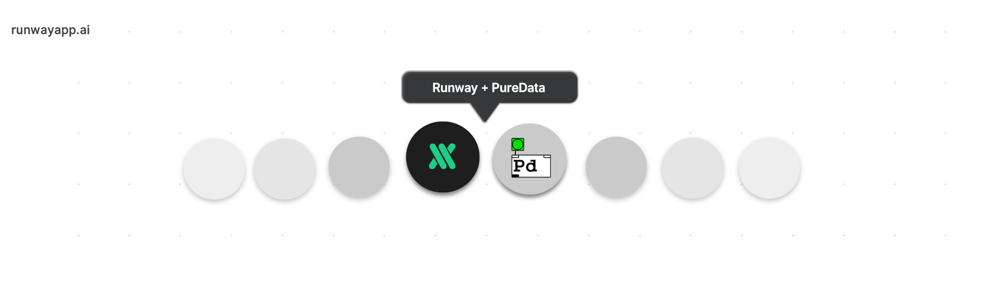

  

# Runway + PureData

A collection of examples and tutorials on how to use [RunwayML](https://runwayml.com/) with [Pure Data](https://puredata.info/).

More RunwayML networking examples [here](https://learn.runwayml.com/#/networking/examples).

🎉Community Contribution

## PureData Prerequisite

You will need to install the purest_json external (available in deken). Installation is described in the tutorial text.

## Examples

### HTTP
* [Skeleton Tracking with PoseNet](/posenet) by [Joel Matthys](http://joel.matthysmusic.com) 🎉

## Contributing

This is still a work in progress. Contributions are welcomed!
