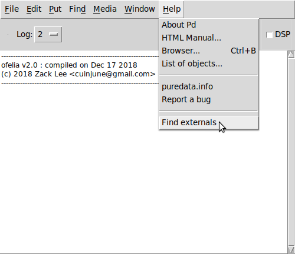
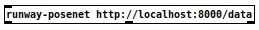
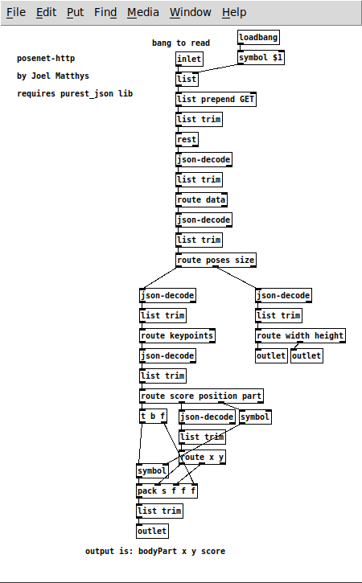
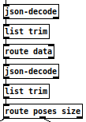
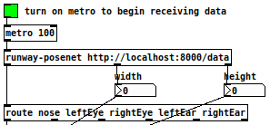
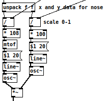

<p align="center">
  
</p>

# PoseNet Tracking with Runway and Pure Data

This tutorial demonstrates how to track body poses in a Pure Data patch by making http requests in real-time with Runway running the PoseNet model. We will track the position of your nose in the camera frame, and use it to control sound output.

### Requirements

* Runway Beta
* [Pure Data](http://puredata.info/downloads/pure-data) version 0.46 or later
  or
* [Purr Data](https://agraef.github.io/purr-data)
* purest_json Pd external (described below)

## Step 1

In this tutorial, we will use PoseNet, which is based on the paper [Towards Accurate Multi-person Pose Estimation in the Wild](https://arxiv.org/abs/1701.01779) and a [Tensorflow.js](https://js.tensorflow.org/) implementation by [Dan Oved](https://www.danioved.com/).

## Step 2

You will need to install the purest_json Pd external in order to parse the data coming from Runway. Please follow the instructions below for your Pd version and operating system.

### Installing on Windows or Mac OSX for Pd 0.49 ("Vanilla")

1. Open Pd.
2. Go to Help->Find Externals

<p align="center">
  
</p>

3. Search for ```purest_json```.
4. Install the latest version for your operating system.
5. Go to your Preferences and add the purest_json folder to your search path.

### Installing on Windows or Mac OSX for Purr Data (Pd-l2ork)

1. Visit https://puredata.info/Members/residuum/software/purest_json/1.4.2/
2. Download and extract the purest_json for your operating system.
3. Open Purr Data. Go to Edit->Preferences and add the purest_json folder to your search path.

### Installing on Debian/Ubuntu Linux for either Pd 0.49 or Purr Data

1. Install pd-purest-json from the Debian repos:

```
sudo apt-get install pd-purest-json
```
2. Open Pd or Purr Data and add /usr/lib/pd/extra/purest_json to your search path.

## Step 3

Open Runway, go to the Model Directory, and select the PoseNet model. Add it to a new Workspace.

## Step 4

In the Choose Input Source section, click on Input and choose Camera. This will activate your webcam.

## Step 5

In the Choose Output section, click on Output and choose HTTP. This will tell Runway to direct the output to a local webpage which Pd will query to get the data.

Take note of the address listed in the Routes box. You'll need this for Steps xxx. It will probably be something like ```http://localhost:8001/data```.

## Step 6

With the Input and Output now selected, click Run PoseNet in the bottom right hand side of the Runway app.

## Step 7

You should see a running stream of data in the JSON section of the Runway app, as well as a pulsing progress bar at the bottom of the camera image. These indicate that the PoseNet model is running in Runway, and it should be sending its data to the address listed in the Routes box in step 5.

## Step 8 (optional)

To see that the data is being transferred to a webpage, open your browser and navigate to the http address from step 3. You'll need the full address, including the number after the colon and the ```/data``` part.

When you enter that address into your browser you should see a JSON object listing all of the data being sent. The data will change if you click the refresh button on your browser.

You may go ahead and close your browser.

## Step 9

Open Pd or Purr Data.

Go to File->Open, navigate to the Runway+PureData directory and open ```posenet_example.pd```.

## Step 10

The data from Runway will be parsed by the abstraction ```runway-posenet```:

<p align="center">
  
</p>

Click on it to see its contents.

<p align="center">
  
</p>

The ```rest``` object queries the webpage for JSON data from Runway. The ```json-decode``` object parses the JSON data in order to route it appropriately in Pd.

#### JSON Objects and Arrays

Runway's output data is encoded into a series of JSON Objects and Arrays.

JSON Objects are enclosed in curly brackets and indexed with keys in quotes:

```
{"height":400,"width":600}
```

JSON Arrays are enclosed in square brackets and make up a comma-separated list which are indexed by number (starting at 0).

```
[25,200.5,16,3.14159265]
```

JSON Objects and JSON Arrays are often nested within other JSON Objects or JSON Arrays.

In Pd, both JSON Objects and JSON Arrays are parsed with ```json-decode```. Every layer of data requires three objects: ```json-decode``` to convert the JSON data into a list, ```list trim``` to remove the leading 'list' symbol, and either ```route``` (for JSON Objects) or ```unpack``` (for JSON Arrays).

In the following example, the "data" object is decoded by the top 3 objects. Then the "poses" and "sizes" objects are decoded and routed separately.

<p align="center">
  
</p>

## Step 11

The output of the ```runway-posenet``` abstraction is:
* Outlet 1: pose data (pose key, x, y)
* Outlet 2: camera image width
* Outlet 3: camera image height

Close the ```runway-posenet``` abstraction and return to ```posenet_example.pd```.

### Step 12

Turn on edit mode and change the http address in ```runway-posenet``` to match the Runway Route address from Step 5 above.

## Step 13

Toggle on the metro at the top of the patch.

<p align="center">
  
</p>

If Pd is receiving the Runway data correctly, the width and height number boxes should change to 600 and 400.

Turn up the volume to hear the sound.

## Step 14

This example is only tracking parts of the face, and only using the nose data from that. To see all of the body parts tracked by PoseNet, look at the output of your data in Runway or at the local http site described in Step 8 above. If you wish to use the data from a different body part, change the ```route object``` to include the pose key you wish to include.

## Step 15

In this example, the data from the nose is unpacked into X and Y values. That information is then used to drive the frequency of two oscillators whose outputs are multipled together, producing amplitude modulation.

<p align="center">
  
</p>

## Summary

This tutorial shows how to use JSON http queries in Pd with purest_json to receive and sonify live data from the PoseNet model in Runway Beta.
